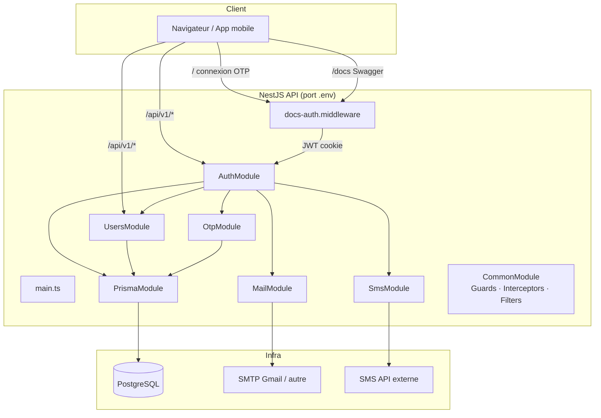

# VAYRIX API — Backend

Backend NestJS 11 pour la plateforme de transport **VAYRIX** (type Uber).

| Élément | Détail |
|---------|--------|
| **Stack** | NestJS 11, Prisma 7, PostgreSQL, JWT, Nodemailer, Swagger |
| **Préfixe API** | `/api/v1` |
| **Documentation** | `http://localhost:<PORT>` → connexion OTP → `/docs` |
| **Santé** | `GET /api/v1/health` |

---

## État du projet

### Modules actifs (fonctionnels)

| Module | Rôle | Statut |
|--------|------|--------|
| **Auth** | Inscription, connexion, OTP, reset MDP, session JWT | ✅ Opérationnel |
| **Users** | Profil utilisateur connecté | ✅ Opérationnel |
| **Otp** | Génération / vérification OTP (table `otp`) | ✅ Opérationnel |
| **Mail** | Emails HTML (OTP, bienvenue, reset MDP) via Nodemailer | ✅ Opérationnel |
| **Sms** | Envoi SMS (`mock` dev / `http` prod) | ✅ Opérationnel |
| **Prisma** | Accès PostgreSQL (pool de connexions) | ✅ Opérationnel |
| **Docs** | Page de connexion + protection Swagger | ✅ Opérationnel |
| **Common** | Guards JWT, rôles, intercepteurs, filtres, Swagger helpers | ✅ Opérationnel |

### Modules en attente (code présent, non chargés dans `AppModule`)

Ces modules existent dans `src/` mais sont **désactivés** le temps de finaliser la migration Prisma. Ils sont exclus du build (`tsconfig.build.json`).

| Module | Domaine métier |
|--------|----------------|
| `drivers` | Chauffeurs |
| `vehicles` | Véhicules |
| `rides` | Courses |
| `payments` | Paiements |
| `notifications` | Notifications |
| `uploads` | Fichiers |
| `sos` | Alertes SOS |
| `sharing` | Partage de courses |
| `realtime` | WebSocket (Socket.IO) |
| `queues` | Files d'attente (BullMQ / Redis) |

### Base de données (Prisma)

- **28 tables** PostgreSQL (schéma français : `Utilisateur`, `Course`, `Chauffeur`, etc.)
- **Seed** : données de démonstration sur l'ensemble des tables
- **OTP** centralisé dans la table `otp` (plus de champs OTP sur `Utilisateur`)

---

## Architecture



### Flux d'une requête API

1. **Entrée** → `ValidationPipe` (DTO) → `JwtAuthGuard` global (sauf `@Public()`)
2. **Controller** → **Service** → **Repository** → **Prisma**
3. **Sortie** → `ApiResponseInterceptor` enveloppe automatiquement la réponse :

```json
{
  "success": true,
  "message": "Utilisateur créé avec succès",
  "data": { ... },
  "meta": null
}
```

### Sécurité

- **JWT** : access token (15 min) + refresh token (7 j)
- **Guard global** : `JwtAuthGuard` — décorateur `@Public()` pour les routes ouvertes
- **Rôles** : `RolesGuard` + `@Roles()` (prêt, utilisé par les modules métier à venir)
- **OTP Guard** : `OtpGuard` disponible pour les étapes sensibles
- **Rate limiting** : `ThrottlerModule`
- **Helmet** : en-têtes HTTP sécurisés
- **Swagger** : protégé par connexion email + OTP (`vayrix_docs_token` cookie)

### Format d'erreur global

Toutes les exceptions HTTP sont uniformisées par `GlobalExceptionFilter` :

```json
{
  "success": false,
  "message": "Utilisateur introuvable",
  "statusCode": 404,
  "timestamp": "2026-07-07T08:00:00.000Z",
  "path": "/api/v1/users/999"
}
```

---

## API fonctionnelles

> Toutes les routes ci-dessous sont préfixées par **`/api/v1`**.  
> Les routes marquées 🔒 nécessitent `Authorization: Bearer <accessToken>`.

### Health

| Méthode | Route | Auth | Description |
|---------|-------|------|-------------|
| `GET` | `/health` | Public | Vérifier que l'API est en ligne |

### Auth — Inscription & connexion

| Méthode | Route | Auth | Description |
|---------|-------|------|-------------|
| `POST` | `/auth/signup` | Public | Inscription CLIENT ou CHAUFFEUR + email de bienvenue |
| `POST` | `/auth/login` | Public | Connexion email/téléphone + mot de passe |
| `POST` | `/auth/send-phone-otp` | Public | Envoyer OTP SMS (connexion) |
| `POST` | `/auth/verify-phone-otp` | Public | Vérifier OTP SMS et obtenir JWT |
| `POST` | `/auth/send-email-otp` | Public | Envoyer OTP email (connexion) |
| `POST` | `/auth/verify-email-otp` | Public | Vérifier OTP email et obtenir JWT |
| `POST` | `/auth/refresh` | Public | Rafraîchir access + refresh token |
| `POST` | `/auth/logout` | 🔒 | Invalider le refresh token |
| `GET` | `/auth/profile` | 🔒 | Profil de l'utilisateur connecté |

### Auth — Réinitialisation mot de passe

| Méthode | Route | Auth | Description |
|---------|-------|------|-------------|
| `POST` | `/auth/forgot-password` | Public | OTP reset par SMS |
| `POST` | `/auth/reset-password` | Public | Confirmer nouveau MDP (SMS) |
| `POST` | `/auth/forgot-password-email` | Public | OTP reset par email |
| `POST` | `/auth/verify-forgot-password-email` | Public | Vérifier OTP reset email |
| `POST` | `/auth/reset-password-email` | Public | Confirmer nouveau MDP (email) |

### Auth — Divers

| Méthode | Route | Auth | Description |
|---------|-------|------|-------------|
| `POST` | `/auth/verify-email` | Public | Vérifier email et activer compte client |
| `POST` | `/auth/resend-code` | Public | Renvoyer un code OTP par SMS |
| `POST` | `/auth/login/otp/request` | Public | *(legacy, masqué Swagger)* alias SMS OTP |
| `POST` | `/auth/login/otp/verify` | Public | *(legacy, masqué Swagger)* alias SMS OTP |

### Users — Profil

| Méthode | Route | Auth | Description |
|---------|-------|------|-------------|
| `GET` | `/users/me` | 🔒 | Mon profil complet |
| `PATCH` | `/users/me` | 🔒 | Modifier nom / prénom |
| `PATCH` | `/users/photo` | 🔒 | Modifier photo de profil |
| `PATCH` | `/users/langue` | 🔒 | Modifier langue |
| `PATCH` | `/users/telephone` | 🔒 | Modifier téléphone |
| `DELETE` | `/users/me` | 🔒 | Supprimer mon compte |
| `GET` | `/users/:id` | 🔒 | Détail d'un utilisateur par ID |

### Comptes de test (seed)

| Rôle | Email | Téléphone | Mot de passe |
|------|-------|-----------|--------------|
| Admin | `admin@vayrix.com` | `+221770000001` | `Password123!` |
| Client | `client@vayrix.com` | `+221770000002` | `Password123!` |
| Chauffeur | `chauffeur@vayrix.com` | `+221770000003` | `Password123!` |
| Admin | `nengue382@gmail.com` | `+237697573894` | `admin123` |

```bash
npx prisma migrate reset --force   # Réinitialiser + seed
npm run prisma:seed                # Seed seul (base vide)
```

---

## Structure du projet

```
Backend cursor/
├── prisma/
│   ├── schema.prisma          # Schéma 28 tables
│   ├── seed.ts                # Données de démonstration
│   └── migrations/            # Migrations SQL
├── generated/prisma/          # Client Prisma généré
├── public/
│   ├── assets/vayrix-logo.png # Logo (page connexion + Swagger)
│   ├── docs-login.html        # Page connexion documentation
│   ├── docs-login.css
│   ├── docs-login.js
│   └── swagger-custom.js      # JWT auto + bouton déconnexion
├── docker/
│   ├── entrypoint.sh          # Migrations + démarrage container
│   └── swarm.env.example      # Modèle déploiement Swarm
├── src/
│   ├── main.ts                # Bootstrap, Swagger, middleware docs
│   ├── app.module.ts          # Modules actifs
│   ├── app.controller.ts      # GET /health
│   ├── config/
│   │   ├── app.config.ts
│   │   ├── database.config.ts
│   │   ├── jwt.config.ts
│   │   ├── mail.config.ts
│   │   ├── sms.config.ts
│   │   ├── swagger.config.ts
│   │   └── configuration.ts   # agrégation rétrocompatible
│   ├── docs/
│   │   └── docs-auth.middleware.ts  # Protection / et /docs
│   ├── auth/
│   │   ├── auth.module.ts
│   │   ├── auth.controller.ts
│   │   ├── auth.service.ts
│   │   ├── repositories/
│   │   ├── dto/
│   │   ├── entities/
│   │   └── strategies/jwt.strategy.ts
│   ├── users/
│   │   ├── users.module.ts
│   │   ├── users.controller.ts
│   │   ├── users.service.ts
│   │   ├── repositories/
│   │   ├── dto/
│   │   └── entities/
│   ├── otp/                   # Service OTP centralisé
│   ├── mail/                  # Nodemailer + templates HTML
│   ├── sms/                   # Provider mock | http
│   ├── prisma/                # PrismaService (pool PG)
│   ├── common/
│   │   ├── responses/         # ApiResponseInterceptor + service + interfaces
│   │   ├── pagination/        # DTO/Service pagination unique
│   │   ├── exceptions/        # GlobalExceptionFilter
│   │   ├── logger/            # LoggerService
│   │   ├── decorators/        # @Public, @Roles, @CurrentUser, @PaginationQuery
│   │   ├── guards/            # JwtAuthGuard, RolesGuard, OtpGuard
│   │   ├── helpers/           # date/phone/string/password/file
│   │   ├── constants/         # roles/status/messages/pagination/otp
│   │   ├── types/             # jwt-payload/api-response/pagination
│   │   ├── filters/           # PrismaExceptionFilter
│   │   ├── interceptors/      # LoggingInterceptor
│   │   ├── swagger/           # Config + helpers Swagger
│   │   └── dto/               # compatibilité ancienne structure
│   │
│   │  # ── Modules métier (présents, non activés) ──
│   ├── drivers/
│   ├── vehicles/
│   ├── rides/
│   ├── payments/
│   ├── notifications/
│   ├── uploads/
│   ├── sos/
│   ├── sharing/
│   ├── realtime/
│   └── queues/
├── .env                       # Configuration locale (unique)
├── .env.example               # Modèle Git (non lu par l'app)
├── docker-stack.yml
├── Dockerfile
└── README.md
```

---

## Prérequis

- Node.js 22+
- PostgreSQL 16+
- Redis 7+ (optionnel — requis pour `queues` / `realtime` à l'activation)
- npm

---

## Installation locale

```bash
npm install
```

Configurez **uniquement** le fichier `.env` à la racine (toutes les variables y sont listées).

### Base de données

```bash
npx prisma migrate dev
npm run prisma:seed
npx prisma generate
```

### Démarrage

```bash
npm run start:dev      # Développement (watch)
npm run build          # Compilation
npm run start:prod     # Production
```

L'API REST est sur `http://localhost:<PORT>/api/v1`.

### Documentation Swagger

1. Ouvrir **`http://localhost:<PORT>`**
2. Non connecté → page de connexion (email + code OTP)
3. Connecté → redirection automatique vers **`/docs`**
4. Bouton **Déconnexion** en haut à droite de Swagger

---

## Variables d'environnement

**Fichier unique : `.env`** — `src/config/configuration.ts` lit `process.env` via `ConfigModule`.

> `.env.example` est un modèle Git sans secrets, **non lu par l'application**.

| Section | Variables clés |
|---------|----------------|
| Application | `NODE_ENV`, `PORT`, `API_PREFIX`, `FRONTEND_URL` |
| Base de données | `DATABASE_URL`, `DATABASE_POOL_MAX` |
| JWT | `JWT_SECRET`, `JWT_REFRESH_SECRET`, `JWT_EXPIRES_IN`, `JWT_REFRESH_EXPIRES_IN` |
| Email | `MAIL_HOST`, `MAIL_PORT`, `MAIL_USER`, `MAIL_PASSWORD`, `MAIL_FROM_*` |
| SMS | `SMS_PROVIDER` (`mock` \| `http`), `SMS_API_URL`, `SMS_API_KEY` |
| OTP | `OTP_EXPIRY_MINUTES`, `OTP_RESEND_COOLDOWN_SECONDS`, `OTP_MAX_ATTEMPTS` |
| Redis | `REDIS_HOST`, `REDIS_PORT`, `REDIS_PASSWORD` |
| CORS | `CORS_ORIGINS` |
| Rate limit | `THROTTLE_TTL`, `THROTTLE_LIMIT` |

> **Gmail :** [mot de passe d'application](https://myaccount.google.com/apppasswords) requis pour `MAIL_PASSWORD`.

En dev (`SMS_PROVIDER=mock`), les codes OTP SMS s'affichent dans les logs serveur.  
En dev, les codes OTP email peuvent aussi apparaître dans les logs (`[MAIL:DEV]`).

---

## Scripts utiles

```bash
npm run build              # Compiler
npm run start:dev          # Dev watch
npm run prisma:migrate     # Migration dev
npm run prisma:seed        # Peupler la BD
npm run prisma:studio      # Interface Prisma
npx prisma migrate reset --force   # Réinitialiser la BD (destructif)
```

---

## Déploiement Docker Swarm

| Fichier | Rôle |
|---------|------|
| `Dockerfile` | Image multi-étapes Node 22 Alpine |
| `docker-stack.yml` | Stack Swarm (API + PostgreSQL + Redis) |
| `docker/entrypoint.sh` | Migrations Prisma + démarrage |
| `docker/swarm.env.example` | Modèle Git pour Swarm (pas pour le dev local) |

```bash
docker swarm init
docker network create --driver overlay vayrix-net

# Secrets
echo "votre-jwt-secret"      | docker secret create vayrix_jwt_secret -
echo "votre-refresh-secret"  | docker secret create vayrix_jwt_refresh_secret -
echo "mot-de-passe-postgres" | docker secret create vayrix_db_password -
echo "mot-de-passe-smtp"     | docker secret create vayrix_mail_password -
echo "cle-api-sms"             | docker secret create vayrix_sms_api_key -

docker build -t vayrix-api:latest .
docker stack deploy -c docker-stack.yml vayrix
```

> Le développement local utilise **uniquement** `.env` à la racine.

---

## Règles obligatoires pour les prochains modules (Agent / Dev)

Ces règles sont **obligatoires** pour tout nouveau module métier (`Role`, `Client`, `Chauffeur`, `Véhicule`, `Course`, etc.).

### Architecture imposée

Chaque module doit respecter exactement cette arborescence :

```txt
module/
  controller/
  service/
  dto/
  entities/
  repository/
  interfaces/
  mappers/
  validators/
```

### Flux technique obligatoire

`Controller -> Service -> Repository (Prisma) -> Database`

- Aucune logique Prisma dans les controllers
- Aucune logique métier dans les repositories
- Les validations spécifiques vont dans `validators/`
- Les transformations de modèle vont dans `mappers/`

### Standards communs à réutiliser

- Réponse API : `src/common/responses/api-response.interceptor.ts`
- Pagination : `src/common/pagination/pagination.service.ts`
- Erreurs globales : `src/common/exceptions/global-exception.filter.ts`
- Logger : `src/common/logger/logger.service.ts`
- Décorateurs : `@CurrentUser()`, `@Public()`, `@Roles()`, `@PaginationQuery()`
- Guards : `JwtAuthGuard`, `RolesGuard`, `OtpGuard`
- Constantes : `src/common/constants/*`
- Helpers : `src/common/helpers/*`
- Types : `src/common/types/*`
- Config : `src/config/*.config.ts` (aucune valeur en dur)

### Swagger obligatoire

Pour chaque endpoint :

- `@ApiTags()` au niveau controller
- `@ApiOperation()` sur chaque route
- `@ApiResponse()` documenté
- `@ApiBearerAuth('JWT')` sur les routes protégées
- DTO/Entities entièrement annotés avec `@ApiProperty()`

---

## Maintenir Swagger à jour

Lors de l'ajout ou la modification d'un endpoint :

1. Annoter le controller : `@ApiTags`, `@ApiOperation`, `@ApiBody`, `@ApiBearerAuth('JWT')`
2. Utiliser les helpers `src/common/swagger/swagger.helpers.ts` :
   - `@ApiWrappedOkResponse(Entity)` — réponse `{ success, data, ... }`
   - `@ApiWrappedCreatedResponse(Entity)` — réponse 201
   - `@ApiPublicErrors()` / `@ApiProtectedErrors()`
3. Ajouter `@ApiProperty` sur chaque champ des DTO et entités
4. Enregistrer le module dans `AppModule` et dans `include` de `main.ts` (`SwaggerModule.createDocument`)

---

Projet privé — **VAYRIX** © 2026
