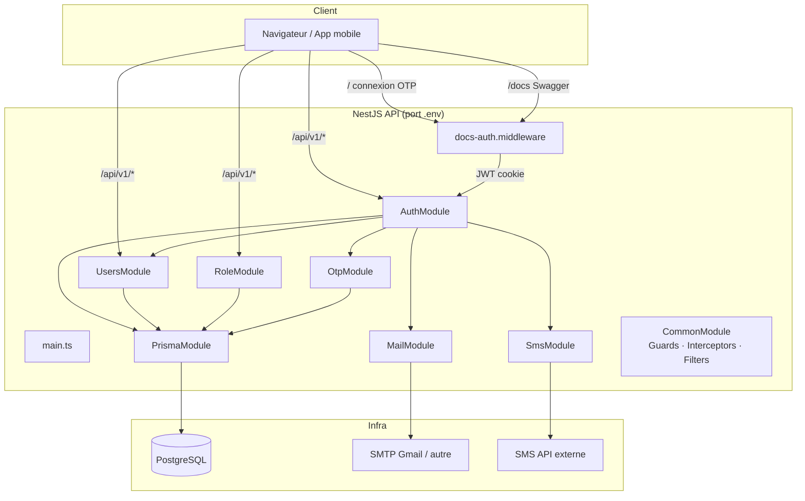

# VAYRIX API — Backend

Backend NestJS 11 pour la plateforme de transport **VAYRIX** (type Uber).

## 📋 Vue d'ensemble

| Élément | Détail |
|---------|--------|
| **Stack** | NestJS 11, Prisma 7, PostgreSQL, JWT, Nodemailer, Swagger |
| **Préfixe API** | `/api/v1` |
| **Documentation** | `http://localhost:<PORT>` → connexion OTP → `/docs` |
| **Santé** | `GET /api/v1/health` |
| **Version** | 0.0.1 |
| **Licence** | Private |

## 🚀 Fonctionnalités principales

- **Authentification complète** : Inscription, connexion (mot de passe/OTP), refresh tokens, logout
- **OTP multi-canal** : Support SMS et email pour la 2FA et la récupération de compte
- **Gestion des utilisateurs** : Profil, photo, langue, téléphone, suppression de compte
- **Sécurité avancée** : JWT avec access/refresh tokens, guards, rate limiting, Helmet
- **Email HTML** : Templates HTML pour OTP, bienvenue, reset mot de passe via Nodemailer
- **SMS** : Provider configurable (mock pour dev, HTTP pour prod)
- **Documentation Swagger** : Protégée par OTP, avec bouton de déconnexion
- **Base de données** : 28 tables PostgreSQL avec schéma français
- **Docker Swarm** : Déploiement production avec secrets et health checks

---

## État du projet

### Modules actifs (fonctionnels)

| Module | Rôle | Statut |
|--------|------|--------|
| **Auth** | Inscription, connexion, OTP, reset MDP, session JWT | ✅ Opérationnel |
| **Users** | Profil utilisateur connecté | ✅ Opérationnel |
| **Role** | Gestion des rôles (ADMIN, CLIENT, CHAUFFEUR, SUPER_ADMIN) | ✅ Opérationnel |
| **Drivers** | Gestion des chauffeurs (profil, statut, position GPS) | ✅ Opérationnel |
| **Vehicles** | Gestion des véhicules (création, statut, types) | ✅ Opérationnel |
| **Otp** | Génération / vérification OTP (table `otp`) | ✅ Opérationnel |
| **Mail** | Emails HTML (OTP, bienvenue, reset MDP) via Nodemailer | ✅ Opérationnel |
| **Sms** | Envoi SMS (`mock` dev / `http` prod) | ✅ Opérationnel |
| **Prisma** | Accès PostgreSQL (pool de connexions) | ✅ Opérationnel |
| **Docs** | Page de connexion + protection Swagger | ✅ Opérationnel |
| **Common** | Guards JWT, rôles, intercepteurs, filtres, Swagger helpers | ✅ Opérationnel |

### Modules en attente (code présent, non chargés dans `AppModule`)

Ces modules existent dans `src/` mais sont **désactivés** le temps de finaliser la migration Prisma. Ils sont exclus du build (`tsconfig.build.json`).

| Module | Domaine métier |
|--------|----------------|
| `rides` | Courses |
| `payments` | Paiements |
| `notifications` | Notifications |
| `uploads` | Fichiers |
| `sos` | Alertes SOS |
| `sharing` | Partage de courses |
| `realtime` | WebSocket (Socket.IO) |
| `queues` | Files d'attente (BullMQ / Redis) |

### Base de données (Prisma)

- **29 tables** PostgreSQL (schéma français : `Utilisateur`, `Course`, `Chauffeur`, etc.)
- **Seed** : données de démonstration avec 4 comptes de test
- **OTP** centralisé dans la table `otp` (plus de champs OTP sur `Utilisateur`)
- **Relations complètes** : Utilisateur ↔ Client/Chauffeur/Administrateur, Course ↔ Paiements, etc.

#### Tables principales

| Table | Description |
|-------|-------------|
| `Utilisateur` | Utilisateurs de base (authentification) |
| `Role` | Rôles système (ADMIN, CLIENT, CHAUFFEUR, SUPER_ADMIN) |
| `Client` | Profils clients passagers |
| `Chauffeur` | Profils chauffeurs |
| `Vehicule` | Véhicules des chauffeurs |
| `TypeVehicule` | Types de véhicules avec tarification |
| `Course` | Courses de transport |
| `Paiement` | Paiements des courses |
| `Otp` | Codes OTP centralisés |
| `Notification` | Notifications utilisateurs |
| `EvaluationChauffeur` | Évaluations des chauffeurs |
| `EvaluationClient` | Évaluations des clients |
| `PositionChauffeur` | Positions GPS chauffeurs |
| `DocumentChauffeur` | Documents chauffeurs |
| `DocumentVehicule` | Documents véhicules |
| `ModeSecurite` | Mode sécurité utilisateurs |
| `AlerteSecurite` | Alertes SOS |
| `EnregistrementAudio` | Enregistrements audio courses |
| `AnalyseSecurite` | Analyses de sécurité |
| `TranscriptionAudio` | Transcriptions audio |
| `ContactUrgence` | Contacts d'urgence |
| `Localisation` | Localisations utilisateurs |
| `PropositionPrix` | Propositions de prix |
| `DemandePartageCourse` | Demandes de partage |
| `ValidationPartageCourse` | Validations de partage de courses |
| `ParticipantCourse` | Participants aux courses |
| `Administrateur` | Administrateurs système |
| `JournalAudit` | Journal d'audit |
| `Tarification` | Règles de tarification |

---

## Architecture technique

### Stack technique

| Composant | Version | Description |
|-----------|---------|-------------|
| **Framework** | NestJS 11 | Framework Node.js TypeScript |
| **ORM** | Prisma 7 | ORM type-safe pour PostgreSQL |
| **Base de données** | PostgreSQL 16+ | Base de données relationnelle |
| **Authentification** | JWT + Passport | Access tokens (15min) + Refresh tokens (7j) |
| **Email** | Nodemailer | Envoi d'emails HTML via SMTP |
| **SMS** | Custom Provider | Mock (dev) / HTTP (prod) |
| **Validation** | class-validator | DTO validation |
| **Documentation** | Swagger/OpenAPI | Documentation interactive |
| **Sécurité** | Helmet + Throttler | HTTP headers + Rate limiting |
| **Tests** | Jest | Framework de tests |
| **Docker** | Docker Swarm | Orchestration containers |

### Architecture applicative


```mermaid
flowchart TB
    subgraph Client
        WEB[Navigateur / App mobile]
    end

    subgraph NestJS["NestJS API (port .env)"]
        MAIN[main.ts]
        MW[docs-auth.middleware]
        AUTH[AuthModule]
        USERS[UsersModule]
        ROLE[RoleModule]
        OTP[OtpModule]
        MAIL[MailModule]
        SMS[SmsModule]
        PRISMA[PrismaModule]
        COMMON[CommonModule<br/>Guards · Interceptors · Filters]
    end

    subgraph Infra
        PG[(PostgreSQL)]
        SMTP[SMTP Gmail / autre]
        SMSAPI[SMS API externe]
    end

    WEB -->|"/" connexion OTP| MW
    WEB -->|"/docs" Swagger| MW
    WEB -->|"/api/v1/*"| AUTH
    WEB -->|"/api/v1/*"| USERS
    WEB -->|"/api/v1/*"| ROLE

    MW -->|JWT cookie| AUTH
    AUTH --> OTP
    AUTH --> MAIL
    AUTH --> SMS
    AUTH --> USERS
    AUTH --> PRISMA
    USERS --> PRISMA
    ROLE --> PRISMA
    OTP --> PRISMA
    PRISMA --> PG
    MAIL --> SMTP
    SMS --> SMSAPI
```

### Flux d'une requête API

1. **Entrée** → `ValidationPipe` (DTO) → `JwtAuthGuard` global (sauf `@Public()`)
2. **Controller** → **Service** → **Repository** → **Prisma**
3. **Sortie** → `ApiResponseInterceptor` enveloppe automatiquement la réponse :

```json
{
  "success": true,
  "message": "Utilisateur créé avec succès",
  "data": { ... },
  "meta": null
}
```

### Sécurité

- **JWT** : access token (15 min) + refresh token (7 j)
- **Guard global** : `JwtAuthGuard` — décorateur `@Public()` pour les routes ouvertes
- **Rôles** : `RolesGuard` + `@Roles()` (prêt, utilisé par les modules métier à venir)
- **OTP Guard** : `OtpGuard` disponible pour les étapes sensibles
- **Rate limiting** : `ThrottlerModule` (100 req / 60s par défaut)
- **Helmet** : en-têtes HTTP sécurisés (CSP, HSTS désactivé pour dev)
- **CORS** : Configurable via `CORS_ORIGINS`
- **Swagger** : protégé par connexion email + OTP (`vayrix_docs_token` cookie)
- **Bcrypt** : Hashage des mots de passe (12 rounds)
- **Validation** : DTO validation avec `class-validator`

### Format d'erreur global

Toutes les exceptions HTTP sont uniformisées par `GlobalExceptionFilter` :

```json
{
  "success": false,
  "message": "Utilisateur introuvable",
  "statusCode": 404,
  "timestamp": "2026-07-07T08:00:00.000Z",
  "path": "/api/v1/users/999"
}
```

---

## 📡 API Endpoints

> Toutes les routes ci-dessous sont préfixées par **`/api/v1`**.  
> Les routes marquées 🔒 nécessitent `Authorization: Bearer <accessToken>`.

### Health

| Méthode | Route | Auth | Description |
|---------|-------|------|-------------|
| `GET` | `/health` | Public | Vérifier que l'API est en ligne |

### Auth — Inscription & connexion

| Méthode | Route | Auth | Description |
|---------|-------|------|-------------|
| `POST` | `/auth/signup` | Public | Inscription CLIENT ou CHAUFFEUR + email de bienvenue |
| `POST` | `/auth/login` | Public | Connexion email/téléphone + mot de passe |
| `POST` | `/auth/send-phone-otp` | Public | Envoyer OTP SMS (connexion) |
| `POST` | `/auth/verify-phone-otp` | Public | Vérifier OTP SMS et obtenir JWT |
| `POST` | `/auth/send-email-otp` | Public | Envoyer OTP email (connexion) |
| `POST` | `/auth/verify-email-otp` | Public | Vérifier OTP email et obtenir JWT |
| `POST` | `/auth/refresh` | Public | Rafraîchir access + refresh token |
| `POST` | `/auth/logout` | 🔒 | Invalider le refresh token |
| `GET` | `/auth/profile` | 🔒 | Profil de l'utilisateur connecté |

### Auth — Réinitialisation mot de passe

| Méthode | Route | Auth | Description |
|---------|-------|------|-------------|
| `POST` | `/auth/forgot-password` | Public | OTP reset par SMS |
| `POST` | `/auth/reset-password` | Public | Confirmer nouveau MDP (SMS) |
| `POST` | `/auth/forgot-password-email` | Public | OTP reset par email |
| `POST` | `/auth/verify-forgot-password-email` | Public | Vérifier OTP reset email |
| `POST` | `/auth/reset-password-email` | Public | Confirmer nouveau MDP (email) |

### Auth — Divers

| Méthode | Route | Auth | Description |
|---------|-------|------|-------------|
| `POST` | `/auth/verify-email` | Public | Vérifier email et activer compte client |
| `POST` | `/auth/resend-code` | Public | Renvoyer un code OTP par SMS |
| `POST` | `/auth/login/otp/request` | Public | *(legacy, masqué Swagger)* alias SMS OTP |
| `POST` | `/auth/login/otp/verify` | Public | *(legacy, masqué Swagger)* alias SMS OTP |

### Users — Profil

| Méthode | Route | Auth | Description |
|---------|-------|------|-------------|
| `GET` | `/users/me` | 🔒 | Mon profil complet |
| `PATCH` | `/users/me` | 🔒 | Modifier nom / prénom |
| `PATCH` | `/users/photo` | 🔒 | Modifier photo de profil |
| `PATCH` | `/users/langue` | 🔒 | Modifier langue |
| `PATCH` | `/users/telephone` | 🔒 | Modifier téléphone |
| `DELETE` | `/users/me` | 🔒 | Supprimer mon compte |
| `GET` | `/users/:id` | 🔒 | Détail d'un utilisateur par ID |

### Drivers — Chauffeurs

| Méthode | Route | Auth | Rôle | Description |
|---------|-------|------|------|-------------|
| `GET` | `/drivers/me` | 🔒 | CHAUFFEUR | Mon profil chauffeur |
| `PATCH` | `/drivers/me` | 🔒 | CHAUFFEUR | Modifier mon profil |
| `PATCH` | `/drivers/me/online` | 🔒 | CHAUFFEUR | Modifier statut en ligne |
| `PATCH` | `/drivers/me/status` | 🔒 | CHAUFFEUR, ADMIN | Modifier statut |
| `POST` | `/drivers/me/location` | 🔒 | CHAUFFEUR | Mettre à jour position GPS |
| `GET` | `/drivers` | 🔒 | ADMIN | Lister tous les chauffeurs |
| `GET` | `/drivers/:id` | 🔒 | ADMIN | Détail d'un chauffeur |

### Vehicles — Véhicules

| Méthode | Route | Auth | Rôle | Description |
|---------|-------|------|------|-------------|
| `POST` | `/vehicles` | 🔒 | CHAUFFEUR | Créer un véhicule |
| `GET` | `/vehicles` | 🔒 | ADMIN, CHAUFFEUR | Lister tous les véhicules |
| `GET` | `/vehicles/:id` | 🔒 | ADMIN, CHAUFFEUR | Détail d'un véhicule |
| `PATCH` | `/vehicles/:id/status` | 🔒 | ADMIN | Modifier statut véhicule |
| `DELETE` | `/vehicles/:id` | 🔒 | ADMIN | Supprimer un véhicule |

### Comptes de test (seed)

| Rôle | Email | Téléphone | Mot de passe |
|------|-------|-----------|--------------|
| Admin | `admin@vayrix.com` | `+221770000001` | `Password123!` |
| Client | `client@vayrix.com` | `+221770000002` | `Password123!` |
| Chauffeur | `chauffeur@vayrix.com` | `+221770000003` | `Password123!` |
| Super Admin | `nengue382@gmail.com` | `+237697573894` | `admin123` |

```bash
npx prisma migrate reset --force   # Réinitialiser + seed
npm run prisma:seed                # Seed seul (base vide)
```

---

## 📁 Structure du projet

```
api-vayrix/
├── prisma/
│   ├── schema.prisma          # Schéma 28 tables PostgreSQL
│   ├── seed.ts                # Données de démonstration (4 comptes test)
│   └── migrations/            # Migrations SQL historiques
├── generated/prisma/          # Client Prisma généré (output)
├── public/
│   ├── assets/vayrix-logo.png # Logo (page connexion + Swagger)
│   ├── docs-login.html        # Page connexion documentation
│   ├── docs-login.css
│   ├── docs-login.js
│   └── swagger-custom.js      # JWT auto + bouton déconnexion
├── docker/
│   ├── entrypoint.sh          # Migrations + démarrage container
│   └── swarm.env.example      # Modèle déploiement Swarm
├── src/
│   ├── main.ts                # Bootstrap, Swagger, middleware docs
│   ├── app.module.ts          # Modules actifs (Auth, Users, Role, etc.)
│   ├── app.controller.ts      # GET /health
│   ├── config/
│   │   ├── app.config.ts
│   │   ├── database.config.ts
│   │   ├── jwt.config.ts
│   │   ├── mail.config.ts
│   │   ├── sms.config.ts
│   │   ├── swagger.config.ts
│   │   └── configuration.ts   # Agrégation configuration .env
│   ├── docs/
│   │   └── docs-auth.middleware.ts  # Protection / et /docs
│   ├── auth/
│   │   ├── auth.module.ts
│   │   ├── auth.controller.ts
│   │   ├── auth.service.ts
│   │   ├── repositories/
│   │   ├── dto/
│   │   ├── entities/
│   │   └── strategies/jwt.strategy.ts
│   ├── users/
│   │   ├── users.module.ts
│   │   ├── users.controller.ts
│   │   ├── users.service.ts
│   │   ├── repositories/
│   │   ├── dto/
│   │   └── entities/
│   ├── modules/
│   │   └── role/              # Module Role (rôles système)
│   ├── otp/                   # Service OTP centralisé
│   ├── mail/                  # Nodemailer + templates HTML
│   ├── sms/                   # Provider mock | http
│   ├── prisma/                # PrismaService (pool PG)
│   ├── common/
│   │   ├── responses/         # ApiResponseInterceptor + service + interfaces
│   │   ├── pagination/        # DTO/Service pagination unique
│   │   ├── exceptions/        # GlobalExceptionFilter
│   │   ├── logger/            # LoggerService
│   │   ├── decorators/        # @Public, @Roles, @CurrentUser, @PaginationQuery
│   │   ├── guards/            # JwtAuthGuard, RolesGuard, OtpGuard
│   │   ├── helpers/           # date/phone/string/password/file
│   │   ├── constants/         # roles/status/messages/pagination/otp
│   │   ├── types/             # jwt-payload/api-response/pagination
│   │   ├── filters/           # PrismaExceptionFilter
│   │   ├── interceptors/      # LoggingInterceptor
│   │   ├── swagger/           # Config + helpers Swagger
│   │   └── dto/               # compatibilité ancienne structure
│   │
│   │  # ── Modules métier (présents, non activés) ──
│   ├── drivers/               # Module chauffeurs (désactivé)
│   ├── vehicles/              # Module véhicules (désactivé)
│   ├── rides/                 # Module courses (désactivé)
│   ├── payments/              # Module paiements (désactivé)
│   ├── notifications/         # Module notifications (désactivé)
│   ├── uploads/               # Module uploads (désactivé)
│   ├── sos/                   # Module alertes SOS (désactivé)
│   ├── sharing/               # Module partage courses (désactivé)
│   ├── realtime/              # Module WebSocket (désactivé)
│   └── queues/                # Module BullMQ/Redis (désactivé)
├── .env                       # Configuration locale (unique)
├── .env.example               # Modèle Git (non lu par l'app)
├── docker-stack.yml           # Stack Docker Swarm
├── Dockerfile                 # Image Docker multi-étapes
├── package.json              # Dépendances NPM
├── tsconfig.json              # Configuration TypeScript
├── nest-cli.json              # Configuration NestJS CLI
├── .prettierrc                # Configuration Prettier
├── eslint.config.mjs          # Configuration ESLint
└── README.md                  # Ce fichier
```

---

## ⚙️ Prérequis

- **Node.js** 22+ (recommandé : dernière LTS)
- **PostgreSQL** 16+ (avec base de données créée)
- **Redis** 7+ (optionnel — requis pour `queues` / `realtime` à l'activation)
- **npm** ou **yarn**
- **Git** (pour cloner le dépôt)

## 🚀 Installation locale

### 1. Cloner le dépôt

```bash
git clone <repository-url>
cd api-vayrix
```

### 2. Installer les dépendances

```bash
npm install
```

### 3. Configuration de l'environnement

Copiez le fichier `.env.example` vers `.env` et configurez les variables :

```bash
cp .env.example .env
```

Configurez **uniquement** le fichier `.env` à la racine (toutes les variables y sont listées). Le fichier `.env.example` est un modèle Git et **n'est pas lu par l'application**.

### 4. Configuration de la base de données

Assurez-vous que PostgreSQL est en cours d'exécution et que la base de données existe.

```bash
# Exemple de création de base PostgreSQL
createdb vayrix_api
```

### 5. Migrations et seed

```bash
# Générer le client Prisma
npx prisma generate

# Exécuter les migrations
npx prisma migrate dev

# Peupler la base avec les données de test
npm run prisma:seed
```

### 6. Démarrage de l'application

```bash
# Mode développement (avec hot-reload)
npm run start:dev

# Mode production
npm run build
npm run start:prod
```

L'API REST sera accessible sur `http://localhost:<PORT>/api/v1` (par défaut : `http://localhost:3000/api/v1`).

### 7. Accès à la documentation Swagger

1. Ouvrir **`http://localhost:<PORT>`** (par défaut : `http://localhost:3000`)
2. Non connecté → page de connexion (email + code OTP)
3. Connecté → redirection automatique vers **`/docs`**
4. Bouton **Déconnexion** en haut à droite de Swagger

**Pour accéder à Swagger en développement :**
- Utilisez un compte de test (ex: `admin@vayrix.com` / `Password123!`)
- Le code OTP s'affichera dans les logs serveur si `SMS_PROVIDER=mock`

---

## 🔐 Variables d'environnement

**Fichier unique : `.env`** — `src/config/configuration.ts` lit `process.env` via `ConfigModule`.

> `.env.example` est un modèle Git sans secrets, **non lu par l'application**.

### Application

| Variable | Défaut | Description |
|----------|--------|-------------|
| `NODE_ENV` | `development` | Environnement (development/production) |
| `PORT` | `3000` | Port d'écoute HTTP |
| `API_PREFIX` | `api/v1` | Préfixe des routes API |
| `FRONTEND_URL` | `http://localhost:3000` | URL frontend pour CORS |

### Base de données

| Variable | Défaut | Description |
|----------|--------|-------------|
| `DATABASE_URL` | - | Chaîne de connexion PostgreSQL |
| `DATABASE_POOL_MAX` | `10` | Taille max du pool de connexions |

### JWT

| Variable | Défaut | Description |
|----------|--------|-------------|
| `JWT_SECRET` | - | Secret pour les access tokens (obligatoire) |
| `JWT_EXPIRES_IN` | `15m` | Durée de validité access token |
| `JWT_REFRESH_SECRET` | - | Secret pour les refresh tokens (obligatoire) |
| `JWT_REFRESH_EXPIRES_IN` | `7d` | Durée de validité refresh token |

### Email (SMTP)

| Variable | Défaut | Description |
|----------|--------|-------------|
| `MAIL_HOST` | `smtp.gmail.com` | Serveur SMTP |
| `MAIL_PORT` | `587` | Port SMTP |
| `MAIL_SECURE` | `false` | SSL/TLS |
| `MAIL_USER` | - | Utilisateur SMTP |
| `MAIL_PASSWORD` | - | Mot de passe SMTP |
| `MAIL_FROM_EMAIL` | - | Email d'envoi |
| `MAIL_FROM_NAME` | `VAYRIX` | Nom d'envoi |
| `MAIL_LOGO_URL` | - | URL logo pour emails HTML |

> **Gmail :** [mot de passe d'application](https://myaccount.google.com/apppasswords) requis pour `MAIL_PASSWORD`.

### SMS

| Variable | Défaut | Description |
|----------|--------|-------------|
| `SMS_PROVIDER` | `mock` | Provider (`mock` ou `http`) |
| `SMS_API_URL` | - | URL API SMS (si provider=http) |
| `SMS_API_KEY` | - | Clé API SMS |
| `SMS_API_SECRET` | - | Secret API SMS |
| `SMS_SENDER_ID` | `VAYRIX` | ID émetteur SMS |

### OTP

| Variable | Défaut | Description |
|----------|--------|-------------|
| `OTP_EXPIRY_MINUTES` | `5` | Durée de validité OTP |
| `OTP_RESEND_COOLDOWN_SECONDS` | `60` | Délai minimum entre renvois |
| `OTP_MAX_ATTEMPTS` | `5` | Nombre max de tentatives |

### Redis

| Variable | Défaut | Description |
|----------|--------|-------------|
| `REDIS_HOST` | `localhost` | Hôte Redis |
| `REDIS_PORT` | `6379` | Port Redis |
| `REDIS_PASSWORD` | - | Mot de passe Redis |

### CORS & Rate Limiting

| Variable | Défaut | Description |
|----------|--------|-------------|
| `CORS_ORIGINS` | `http://localhost:3000` | Origines autorisées (séparées par virgules) |
| `THROTTLE_TTL` | `60000` | Délai rate limiting (ms) |
| `THROTTLE_LIMIT` | `100` | Nombre max de requêtes |

### Stockage & Tarification

| Variable | Défaut | Description |
|----------|--------|-------------|
| `STORAGE_PATH` | `storage` | Chemin stockage fichiers |
| `MAX_FILE_SIZE` | `10485760` | Taille max fichier (octets) |
| `CURRENCY` | `XOF` | Devise tarification |
| `BASE_FARE` | `500` | Prix de base course |
| `PER_KM_RATE` | `250` | Prix par km |
| `PER_MIN_RATE` | `50` | Prix par minute |

### Notes de développement

- En dev (`SMS_PROVIDER=mock`), les codes OTP SMS s'affichent dans les logs serveur
- En dev, les codes OTP email peuvent aussi apparaître dans les logs (`[MAIL:DEV]`)
- Les secrets JWT doivent être uniques et robustes en production

---

## 🛠️ Scripts utiles

```bash
# Développement
npm run start:dev          # Mode développement avec hot-reload
npm run start:debug        # Mode développement avec debug
npm run build              # Compiler le projet
npm run start:prod         # Démarrer en production

# Tests
npm run test               # Exécuter les tests unitaires
npm run test:watch         # Tests en mode watch
npm run test:cov           # Tests avec couverture
npm run test:e2e           # Tests end-to-end

# Prisma / Base de données
npm run prisma:generate   # Générer le client Prisma
npm run prisma:migrate     # Migration développement
npm run prisma:seed        # Peupler la base de données
npm run prisma:studio      # Ouvrir Prisma Studio (interface visuelle)
npx prisma migrate reset --force   # Réinitialiser la base (destructif)

# Code quality
npm run lint               # Linter avec auto-fix
npm run format             # Formatter avec Prettier
```

---

## 🐳 Déploiement Docker Swarm

### Architecture de déploiement

| Fichier | Rôle |
|---------|------|
| `Dockerfile` | Image multi-étapes Node 22 Alpine |
| `docker-stack.yml` | Stack Swarm (API + PostgreSQL + Redis) |
| `docker/entrypoint.sh` | Migrations Prisma + démarrage container |
| `docker/swarm.env.example` | Modèle Git pour Swarm (pas pour le dev local) |

### Prérequis Swarm

- Docker Swarm initialisé sur le manager
- Réseau overlay créé
- Secrets Docker créés

### Instructions de déploiement

```bash
# 1. Initialiser Swarm (si pas déjà fait)
docker swarm init

# 2. Créer le réseau overlay
docker network create --driver overlay vayrix-net

# 3. Créer les secrets Docker
echo "votre-jwt-secret"      | docker secret create vayrix_jwt_secret -
echo "votre-refresh-secret"  | docker secret create vayrix_jwt_refresh_secret -
echo "mot-de-passe-postgres" | docker secret create vayrix_db_password -
echo "mot-de-passe-smtp"     | docker secret create vayrix_mail_password -
echo "cle-api-sms"           | docker secret create vayrix_sms_api_key -

# 4. Construire l'image
docker build -t vayrix-api:latest .

# 5. Déployer la stack
docker stack deploy -c docker-stack.yml vayrix
```

### Commandes utiles Swarm

```bash
# Voir les services
docker stack services vayrix

# Voir les tâches
docker stack ps vayrix

# Logs du service API
docker service logs vayrix_api -f

# Supprimer la stack
docker stack rm vayrix
```

### Configuration de production

La stack Swarm inclut :
- **2 replicas** de l'API (avec rolling updates)
- **PostgreSQL** avec volume persistant
- **Redis** pour les queues/realtime
- **Health checks** sur tous les services
- **Resource limits** (CPU, mémoire)
- **Secrets Docker** pour les données sensibles

> Le développement local utilise **uniquement** `.env` à la racine.

---

## 📐 Règles de développement

Ces règles sont **obligatoires** pour tout nouveau module métier.

### Architecture imposée

Chaque module doit respecter exactement cette arborescence :

```txt
module/
  controller/
  service/
  dto/
  entities/
  repository/
  interfaces/
  mappers/
  validators/
```

### Flux technique obligatoire

`Controller -> Service -> Repository (Prisma) -> Database`

- Aucune logique Prisma dans les controllers
- Aucune logique métier dans les repositories
- Les validations spécifiques vont dans `validators/`
- Les transformations de modèle vont dans `mappers/`

### Standards communs à réutiliser

- Réponse API : `src/common/responses/api-response.interceptor.ts`
- Pagination : `src/common/pagination/pagination.service.ts`
- Erreurs globales : `src/common/exceptions/global-exception.filter.ts`
- Logger : `src/common/logger/logger.service.ts`
- Décorateurs : `@CurrentUser()`, `@Public()`, `@Roles()`, `@PaginationQuery()`
- Guards : `JwtAuthGuard`, `RolesGuard`, `OtpGuard`
- Constantes : `src/common/constants/*`
- Helpers : `src/common/helpers/*`
- Types : `src/common/types/*`
- Config : `src/config/*.config.ts` (aucune valeur en dur)

### Documentation Swagger obligatoire

Pour chaque endpoint :

- `@ApiTags()` au niveau controller
- `@ApiOperation()` sur chaque route
- `@ApiResponse()` documenté
- `@ApiBearerAuth('JWT')` sur les routes protégées
- DTO/Entities entièrement annotés avec `@ApiProperty()`

### Mise à jour Swagger

Lors de l'ajout ou la modification d'un endpoint :

1. Annoter le controller : `@ApiTags`, `@ApiOperation`, `@ApiBody`, `@ApiBearerAuth('JWT')`
2. Utiliser les helpers `src/common/swagger/swagger.helpers.ts` :
   - `@ApiWrappedOkResponse(Entity)` — réponse `{ success, data, ... }`
   - `@ApiWrappedCreatedResponse(Entity)` — réponse 201
   - `@ApiPublicErrors()` / `@ApiProtectedErrors()`
3. Ajouter `@ApiProperty` sur chaque champ des DTO et entités
4. Enregistrer le module dans `AppModule` et dans `include` de `main.ts` (`SwaggerModule.createDocument`)

---

## 🔧 Dépannage

### Problèmes courants

**Erreur de connexion PostgreSQL**
```bash
# Vérifier que PostgreSQL est en cours d'exécution
pg_isready

# Vérifier la base de données existe
psql -U postgres -l
```

**Erreur Prisma "Client not generated"**
```bash
npm run prisma:generate
```

**Erreur de migration**
```bash
# Réinitialiser complètement la base (attention : destructif)
npx prisma migrate reset --force
```

**OTP non reçu en développement**
- Vérifiez que `SMS_PROVIDER=mock` dans `.env`
- Les codes OTP s'affichent dans les logs serveur
- Pour email, vérifiez la configuration SMTP

**Erreur JWT "Invalid token"**
- Vérifiez que `JWT_SECRET` et `JWT_REFRESH_SECRET` sont définis
- En production, utilisez des secrets robustes
- Les tokens expirent : utilisez `/auth/refresh` pour renouveler

### Logs et debugging

```bash
# Logs en temps réel (mode dev)
npm run start:dev

# Logs Docker Swarm
docker service logs vayrix_api -f

# Logs PostgreSQL
docker service logs vayrix_postgres -f
```

---

## 📚 Ressources supplémentaires

### Documentation officielle

- [NestJS Documentation](https://docs.nestjs.com/)
- [Prisma Documentation](https://www.prisma.io/docs)
- [PostgreSQL Documentation](https://www.postgresql.org/docs/)
- [Docker Swarm Documentation](https://docs.docker.com/engine/swarm/)

### Outils de développement

- **Prisma Studio** : Interface visuelle pour la base de données (`npm run prisma:studio`)
- **Swagger UI** : Documentation interactive des API (`http://localhost:3000/docs`)
- **Postman/Insomnia** : Pour tester les endpoints API

### Architecture et patterns

- **Repository Pattern** : Séparation logique d'accès aux données
- **DTO Pattern** : Data Transfer Objects pour validation
- **Guard Pattern** : Protection des routes avec NestJS
- **Interceptor Pattern** : Transformation des réponses API

---

## 🤝 Contribution

### Guidelines de contribution

1. **Fork** le projet
2. Créer une **branche** (`git checkout -b feature/ma-fonctionnalite`)
3. **Commit** vos changements (`git commit -m 'Ajout de ma fonctionnalité'`)
4. **Push** vers la branche (`git push origin feature/ma-fonctionnalite`)
5. Ouvrir une **Pull Request**

### Code style

- Suivez les conventions ESLint et Prettier
- Ajoutez des commentaires pour le code complexe
- Documentez les nouvelles fonctions avec JSDoc
- Mettez à jour la documentation Swagger pour les nouveaux endpoints

### Tests

- Ajoutez des tests unitaires pour les nouvelles fonctions
- Ajoutez des tests e2e pour les nouveaux endpoints
- Assurez-vous que tous les tests passent avant de commit

---

## 📞 Support

Pour toute question ou problème :

- **Email** : support@vayrix.com
- **Documentation** : `http://localhost:3000/docs` (après connexion)
- **Issues** : Créez une issue sur le dépôt Git

---

## 📄 Licence

Projet privé — **VAYRIX** © 2026

Tous droits réservés. Ce projet est la propriété exclusive de VAYRIX.

---

## 🎯 Roadmap

### À venir (modules désactivés)

- [ ] **Drivers** : Gestion complète des chauffeurs
- [ ] **Vehicles** : Gestion des véhicules et types
- [ ] **Rides** : Système de courses complet
- [ ] **Payments** : Intégration paiements
- [ ] **Notifications** : Système de notifications push
- [ ] **Uploads** : Gestion des fichiers uploads
- [ ] **SOS** : Système d'alertes sécurité
- [ ] **Sharing** : Partage de courses
- [ ] **Realtime** : WebSocket pour tracking en temps réel
- [ ] **Queues** : BullMQ pour tâches asynchrones

### Améliorations prévues

- [ ] Tests unitaires complets
- [ ] Tests e2e automatisés
- [ ] CI/CD pipeline
- [ ] Monitoring et logging avancé
- [ ] Cache Redis pour performances
- [ ] Rate limiting par utilisateur
- [ ] Webhooks pour intégrations externes
